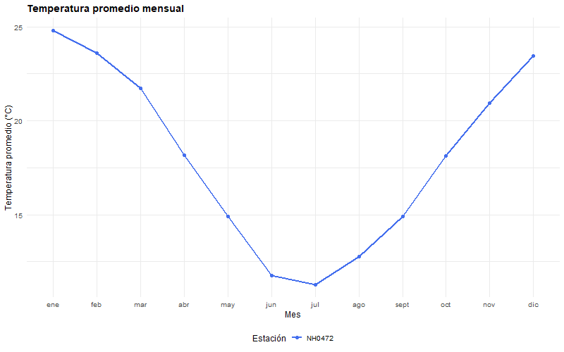

<!-- README.md is generated from README.Rmd. Please edit that file -->

```{r, include = FALSE}
knitr::opts_chunk$set(
  collapse = TRUE,
  comment = "#>",
  fig.path = "man/figures/README-",
  out.width = "100%"
)
```

# estacionr

<!-- badges: start -->
<!-- badges: end -->

**estacionr** es un paquete en desarrollo orientado al análisis de datos meteorológicos provenientes de estaciones del sistema *SIGA–INTA (Argentina)*.  

El paquete ofrece un conjunto de funciones para:

- *Importar* y *leer* registros de estaciones meteorológicas.  
- *Resumir* y *visualizar* variables climáticas clave como temperatura, humedad o precipitaciones.  
- *Comparar* datos entre estaciones y facilitar análisis exploratorios.  

Está diseñado con fines *académicos y de aprendizaje*, y no reemplaza los sistemas oficiales de adquisición ni validación de datos.


estacionr es un paquete de prueba desarrollado en el marco de la materia Programación II
de la Licenciatura en Ciencia de Datos.

Su propósito es explorar el proceso de creación y desarrollo colaborativo de paquetes en R.

## Instalación

Podés instalar la ersión de prueba de estacionR desde [GitHub](https://github.com/) with:

``` r
# install.packages("pak")
pak::pak("ifylopez/estacionr")
```
### Primer paso:
Para usar el paquete, deberás descargarlo de la siguiente manera:
```r
library(estacionr)
```

### Datasets incluidos:

El paquete incluye varios datasets listos para usar:

| Nombre        | Descripción |
|----------------|-------------|
| NH0046       | Registros diarios de la estación NH0046 |
| NH0098       | Registros diarios de la estación NH0098 |
| NH0437       | Registros diarios de la estación NH0437 |
| NH0472       | Registros diarios de la estación NH0472 |
| NH0910       | Registros diarios de la estación NH0910 |
| metadatos_completos | Tabla con información descriptiva de las estaciones | 

Ejemplo de uso rápido:

``` r
data("NH0472")   # carga el dataset incluido
head(NH0472)     # muestra las primeras filas
```

### Funciones incluidas: 

1. *leer_datos_estacion*: Recibe el ID de la estación a leer y la ruta donde se desea guardar el archivo. Luego, descarga (si es necesario) y lee el archivo CSV de la estación meteorológica y devuelve un objeto de la clase data.frame con los registros correspondientes.

2. *tabla_resumen_temperatura*: Recibe uno o mas data frames con registros meteorológicos (de las estaciones disponibles en el dataset del paquete). Luego, calcula la media, mínimo, máximo, desviación y número de observaciones de la variable temperatura_abrigo_150cm y devuelve un objeto de la clase data.frame con los datos calculados previamente.

3. *grafico_temperatura_mensual*: Recibe un data frame con los registros meteorológicos de una o mas estaciones, colores para generar el gráfico y el titulo de este. Luego, calcula el promedio mensual de temperatura_abrigo_150cm y devuelve un gráfico que muestra la temperatura promedio mensual.

## Uso de funciones:

#### A continuación mostramos un ejemplo mínimo y completo del flujo de trabajo principal:

```r
# 1. Leer datos (ejemplo local)
df <- leer_datos_estacion("NH0472", "datos/NH0472.csv")

# 2. Generar tabla resumen

resumen <- tabla_resumen_temperatura(df)

# 3. Graficar promedio mensual
grafico_temperatura_mensual(df, titulo = "Temperatura promedio mensual")
```



### Cómo contribuir al paquete:
1. Hacé un fork y cloná el proyecto:
Creá un fork de este repositorio en tu cuenta de GitHub y descargá una copia local en tu computadora para trabajar en tus modificaciones.

2. Realizá tus cambios y enviá un pull request:
Implementá las mejoras o correcciones que consideres necesarias en tu versión del proyecto.
Luego, abrí un pull request hacia la rama principal del repositorio original, explicando claramente el objetivo y el alcance de tu contribución.

### Desarrollado por:

- [Mateo Lopez](https://github.com/ifylopez)
  
- [Benicio Lozano](https://github.com/BeniLozano2007)
